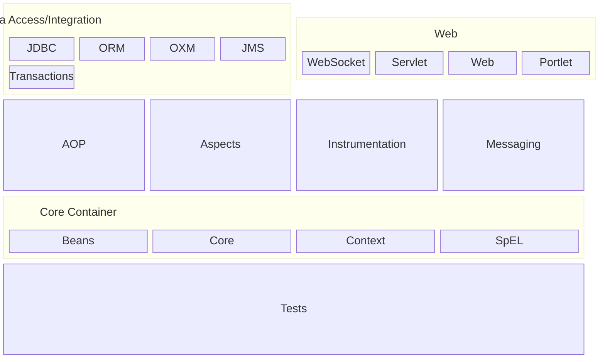

# DIO - Trilha Spring Framework
<div style="display:inline-block">
        <picture  title="Java">
                <source height="40" width="40" media="(prefers-color-scheme: light)" srcset="https://cdn.simpleicons.org/openjdk/000000">
                
        </picture>
        <picture  title="Apache Maven">
                <source height="40" width="40" media="(prefers-color-scheme: light)" srcset="https://cdn.simpleicons.org/apachemaven/000000">
                
        </picture>
        <picture  title="Spring Boot">
                <source height="40" width="40" media="(prefers-color-scheme: light)" srcset="https://cdn.simpleicons.org/springboot/000000">
                
        </picture>
        <picture  title="MySQL">
                <source height="40" width="40" media="(prefers-color-scheme: light)" srcset="https://cdn.simpleicons.org/mysql/000000">
                
        </picture>
</div>

## Autor dos Exercícios e Repositório Original
- [Gleyson Sampaio](https://github.com/glysns)
- [Spring Boot](https://github.com/digitalinnovationone/dio-springboot/tree/main)

## Spring Framework
`Spring` é um framework open source desenvolvido para a plataforma Java que usa `inversão de controle` (IoC) e `injeção de dependências` (DI) para facilitar o desenvolvimento de aplicações.

## Exercícios
Este repositório contém exercícios que demonstram a utilização do Spring Framework e que cobrem os seguintes temas:
- Spring Framework
- Spring Boot
- Beans versus Components
- Scopes
- Properties Value e Configuration Properties
- ORM e JPA
- Spring Data JPA
- Conexão com Banco de Dados
- JPA Repository

## Módulos
A arquitetura do Spring Framework consiste em funcionalidades organizadas em quase 20 `módulos`. Esses modulos são agrupados em Core Container, Data Access/Integration, Web, AOP (Aspect Oriented Programming), Instrumentation, e Test, como demonstrado no diagrama a seguir.


## Inversão de Controle (IoC)
`Inversão de controle` é o princípio de transferir o controle de objetos ou porções de um programa para um framework ou container. No Spring Framework, esse princípio é implementado por meio da interface `ApplicationContext` e dos `beans`.

- `ApplicationContext`: é a interface que representa o container de inversão de controle no Spring. É capaz de instanciar, configurar, montar e gerenciar o ciclo de vida de qualquer tipo de objeto;
- `Beans`: são os objetos gerenciados por um container de inversão de controle como o próprio ApplicationContext ou uma de suas implementações como a WebApplicationContext.

## Injeção de Dependência (DI)
`Injeção de dependência` é uma forma especializada de inversão de controle através da qual objetos definem suas dependências apenas por argumentos de construtor, argumentos passados a um factory method ou propriedades definidas na instância de um objeto antes que ela seja construída ou retornada de um factory method. O container então busca as dependências (anotadas com `@Bean` ou `@Component`) correspondentes a essas definições e as injeta nelas automaticamente por meio da anotação `@Autowired`.


### Sem Inversão de Controle
Sem inversão de controle, os objetos são gerenciados manualmente:
```java
Calculadora calculadora = new Calculadora();
```

### Com Inversão de Controle
Com inversão de controle, os objetos são gerenciados pelo container, logo, o operador `new` não é utilizado:
```java
@Autowired
Calculadora calculadora;
```

## Bean Scopes
Quando um `bean` é definido, é como se fosse uma receita para a criação de instâncias reais da classe definida. Nessa definição, é possível controlar não apenas as dependências e os valores de configuração que devem ser conectados aos objetos criados a partir dela, mas também controlar o escopo desses objetos. O Spring Framework suporta seis escopos:

| Escopo        | Descrição                                                                                                                                          |
|---------------|----------------------------------------------------------------------------------------------------------------------------------------------------|
| `singleton`   | (Padrão) Apenas uma única instância do bean é criada e todas as requisições pelo bean retornam a mesma instância                                   |
| `prototype`   | Uma nova instância do bean é criada a cada requisição pelo bean                                                                                    |
| `request`     | Uma única instância do bean é criada para o ciclo de vida de uma requisição HTTP (válido apenas em contextos WebApplicationContext cientes da web) |
| `session`     | Uma única instância do bean é criada para o ciclo de vida de uma sessão HTTP (válido apenas em contextos WebApplicationContext cientes da web)     |
| `application` | Uma única instância do bean é criada para o ciclo de vida de um ServletContext (válido apenas em contextos WebApplicationContext cientes da web)   |
| `websocket`   | Uma única instância do bean é criada  para o ciclo de um WebSocket (válido apenas em contextos WebApplicationContext cientes da web)               |

## Referências
- Introduction to Spring Framework - https://docs.spring.io/spring-framework/docs/4.0.x/spring-framework-reference/html/overview.html
- Como Começar com o Spring - https://www.devmedia.com.br/exemplo/como-comecar-com-spring/73
- Introduction to the Spring IoC Container and Beans - https://docs.spring.io/spring-framework/reference/core/beans/introduction.html
- Intro to Inversion of Control and Dependency Injection with Spring - https://www.baeldung.com/inversion-control-and-dependency-injection-in-spring
- Bean Scopes - https://docs.spring.io/spring-framework/reference/core/beans/factory-scopes.html
- Quick Guide to Spring Bean Scopes - https://www.baeldung.com/spring-bean-scopes