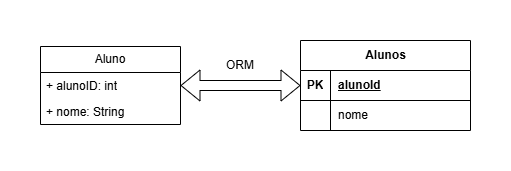
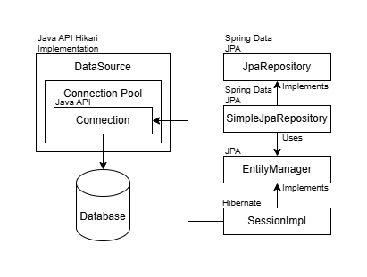

# ORM e JPA
`ORM` e `JPA` significam respectivamente Object Relational Mapping e Java Persistence API, atualmente Jakarta Persistence API.

## O que é ORM?
`ORM` é uma técnica de mapeamento `objeto-relacional` que aproxima o paradigma de aplicações orientadas a objetos ao paradigma do banco de dados relacional. O ORM mapeia a estrutura das classes contidas no código-fonte para as tabelas no banco de dados, como pode ser visto na figura a seguir.

<p align="center">
        
</p>

As tabelas seguem a mesma estrutura das classes e armazenam informações dos objetos, que são instâncias concretas das classes. A criação das tabelas e operações CRUD (criar, ler, atualizar e excluir) são realizadas pelo ORM por meio da geração automática de código `SQL`.

## O que é JPA?
`JPA` é uma especificação que fornece um modelo de persistência para POJOs (Plain Old Java Objects), ou seja, objetos simples, não-abstratos e concretos para `ORM`. JPA define as especificações de como as operações CRUD devem ocorrer. Essas operações são realizadas por implementações concretas do JPA como `Hibernate`, `TopLink` e `OpenJPA`.

## Mapeamento
Para que o mapeamento seja viável, o JPA oferece diversas anotações de configuração. As mais utilizadas são:

| Anotação          | Definição                                                                                                     |
|-------------------|---------------------------------------------------------------------------------------------------------------|
| `@Entity`         | Denota que a classe anotada é uma entidade, ou seja, uma classe que mapeia uma tabela no banco de dados       |
| `@Table`          | Especifica a tabela da entidade anotada                                                                       |
| `@Id`             | Especifica o identificador da entidade                                                                        |
| `@GeneratedValue` | Define que o valor do identificador da entidade é gerado automaticamente utilizando a estratégia definida     |
| `@Column`         | Configura o mapeamento entre um atributo simples de uma entidade e uma coluna da tabela no banco de dados     |

Na prática, o mapeamento é definido da seguinte forma:

```java
@Entity
@Table(name = "alunos")
public class Aluno {
        @Id
        @GeneratedValue(strategy = GenerationType.IDENTITY)
        @Column(name = "user_id")
        private Integer id;

        // Colunas sem nome definido terão o nome do atributo
        @Column(length = 50, nullable = false)
        private String nome;

        @Column(length = 6, nullable = false)
        private double nota;
```

## Spring Data JPA
`Spring Data JPA` simplifica a criação de repositórios baseados em JPA. Permite a criação de interfaces de repositórios que são automaticamente implementadas pelo Spring. Além de fornecer operações CRUD, fornece também a possibilidade de criar operações personalizadas apenas nomeando os métodos da interface de acordo com as convenções do Spring Data JPA.

## Conexão com MySQL
Várias propriedades podem ser definidas no arquivo `application.properties`, como as propriedades necessárias para configurar a conexão com o banco de dados escolhido. Por exemplo, para um banco de dados MySQL, as seguintes configurações podem ser utilizadas:

```properties
# Obrigatórias de acordo com o banco de dados utilizado
spring.datasource.url=jdbc:mysql://localhost:3306/nome_do_banco
spring.datasource.username=nome_do_usuario
spring.datasource.password=senha_do_usuario
spring.datasource.driver-class-name=com.mysql.cj.jdbc.Driver

# Opcionais
spring.jpa.hibernate.ddl-auto=create
spring.jpa.show-sql=true
```

- `spring.datasource.url`: define a String de conexão com o banco de dados MySQL, onde "nome_do_banco" deve ser substituído pelo nome específico do banco de dados criado no MySQL;
- `spring.datasource.username`: especifica qual usuário acessará o banco;
- `spring.datasource.password`: especifica qual senha está vinculada ao usuário;
- `spring.datasource.driver-class-name`: define a classe do driver JDBC, que é o responsável por estabelecer a conexão com o banco;
- `spring.jpa.hibernate.ddl-auto`: especifica se comandos de definição e gerenciamento da estrutura do banco de dados serão gerados automaticamente ou não;
- `spring.jpa.show-sql`: define que os comandos SQL gerados pelo JPA serão mostrados no terminal/console.

## EntityManager
O diagrama a seguir demonstra a arquitetura do EntityManager no contexto do Spring Data Jpa.

<p align="center">
        
</p>

- `DataSource`: é uma fábrica de conexões para a fonte de dados física que o objeto DataSource representa;
- `ConnectionPool`: é um cache (bloco de memória de armazenamento temporário) de objetos Connection, que representam uma conexão física com o banco de dados e que podem ser usados por uma aplicação para se conectar com o banco de dados;
- `JpaRepository`: oferece métodos para gerenciar um tipo específico de entidade, mantendo informações sobre esse tipo e gerando operações CRUD específicas para ele;
- `SimpleJpaRepository`: é a implementação concreta de JpaRepository;
- `EntityManager`: é uma interface utilizada para interagir com o contexto de persistência (um conjunto de entidades gerenciadas associadas a uma transação lógica), responsável por gerenciar as instâncias de entidades;
- `SessionImpl`: é uma implementação concreta da interface Session, que é a interface principal de tempo de execução entre uma aplicação Java e o Hibernate. Representa a noção de um contexto de persistência.

## Referências
- O que é ORM? - https://www.treinaweb.com.br/blog/o-que-e-orm/
- The Java Persistence API - A Simpler Programming Model for Entity Persistence - https://www.oracle.com/technical-resources/articles/java/jpa.html
- All JPA Annotations: Mapping Annotations - https://dzone.com/articles/all-jpa-annotations-mapping-annotations
- Spring Data JPA - https://spring.io/projects/spring-data-jpa
- Interface DataSource - https://docs.oracle.com/javase/8/docs/api/javax/sql/DataSource.html
- Connecting with DataSource Objects - https://docs.oracle.com/javase/tutorial/jdbc/basics/sqldatasources.html
- Interface JpaRepository<T,ID> - https://docs.spring.io/spring-data/jpa/docs/current/api/org/springframework/data/jpa/repository/JpaRepository.html
- Class SimpleJpaRepository<T,ID> - https://docs.spring.io/spring-data/jpa/docs/current/api/org/springframework/data/jpa/repository/support/SimpleJpaRepository.html
- Interface EntityManager - https://docs.oracle.com/javaee/7/api/javax/persistence/EntityManager.html
- Class SessionImpl - https://docs.jboss.org/hibernate/orm/6.0/javadocs/org/hibernate/internal/SessionImpl.html